## 0 易混总结

### 1static和final

final可以修饰：属性，方法，类，局部变量（方法中的变量）

     final修饰的属性的初始化可以在编译期，也可以在运行期，初始化后不能被改变。
    
     final修饰的属性跟具体对象有关，在运行期初始化的final属性，不同对象可以有不同的值。
    
     final修饰的属性表明是一个常数（创建后不能被修改）。
    
     final修饰的方法表示该方法在子类中不能被重写，final修饰的类表示该类不能被继承。
    
     对于基本类型数据，final会将值变为一个常数（创建后不能被修改）；但是对于对象句柄（亦可称作引用或者指针），final会将句柄变为一个常数（进行声明时，必须将句柄初始化到一个具体的对象。而且不能再将句柄指向另一个对象。但是，对象的本身是可以修改的。这一限制也适用于数组，数组也属于对象，数组本身也是可以修改的。方法参数中的final句柄，意味着在该方法内部，我们不能改变参数句柄指向的实际东西，也就是说在方法内部不能给形参句柄再另外赋值）。

static可以修饰：属性，方法，代码段，内部类（静态内部类或嵌套内部类）

**static不能修饰变量**

     static修饰的属性的初始化在编译期（类加载的时候），初始化后能改变。
    
     static修饰的属性所有对象都只有一个值。
    
     static修饰的属性强调它们只有一个。
    
     static修饰的属性、方法、代码段跟该类的具体对象无关，不创建对象也能调用static修饰的属性、方法等
    
     static和“this、super”势不两立，static跟具体对象无关，而this、super正好跟具体对象有关。
    
     static不可以修饰局部变量。

static final和final static没什么区别，一般static写在前面。

static修饰的属性强调它们只有一个，final修饰的属性表明是一个常数（创建后不能被修改）。static final修饰的属性表示一旦给值，就不可修改，并且可以通过类名访问。

static final也可以修饰方法，表示该方法不能重写，可以在不new对象的情况下调用。

static final修饰的属性表示一旦给值，就不可修改，并且可以通过类名访问。 

## 1.概述

- Java语言的前身是**Oak**语言

- Java语言特点：

  - 简单性：去掉了C和C++中最容易出错的**指针**和最难理解的**多重继承**等技术，通过**垃圾自动回收机制**简化了程序内存管理，**统一了各种数据类型在不同操作系统平台上所占内存大小**。
  - 平台无关性：编译后转换为字节码，可以跨平台运行
  - 面向对象：完全的面向对象语言
  - 分布式：程序和数据可分散在网络的不同主机上运行和存储
  - 安全性：
    - 语言定义：取消指针，自动回收垃圾
    - 字节码检查阶段：限制对象的存储权限，系统堆栈溢出，参数类型一致性
    - 程序执行阶段：限制Java小程序的不正当使用
  - 多线程
  - 解释编译两种执行方式
  - 丰富的API文档和类库

- Java程序运行过程

  Java源程序 （.java），字节码(.class)

- Java虚拟机：软件方式实现一台假想机，JVM有自己想象中的硬件
- JRE：是Java执行环境，包括Java SE API与JVM
- JDK：(J包括了javac、java、javadoc等工具程序，对于要开发Java程序的人，必须安装JDK。JDK本身包含了JRE。
- Java程序分类：
  - Java应用程序：完整的、可独立运行运行的Java程序。必须包含一个main()方法。
  - Java小应用程序（Applet）：嵌入在HTML页中，靠Web浏览器激活Java虚拟机来运行的程序，在客户端执行
  - 服务器端小程序(Servlet)：以Web服务器为容器，靠Web服务器来加载和运行。在服务器端执行
  - Javabean：本身不能独立运行，必须以Java应用程序、Applet、Servlet或者Javabean为容器才能执行。分为可视化与非可视化两种。

- 开发Java程序步骤：
  - 编辑：采用编辑器编写Java源程序(.java)。
  - 编译：Java源程序经过Java编译器的编译可以生成Java字节码文件(.class)。
  - 运行：Java字节码能够在JVM上执行，JVM机通过解释器执行Java字节码文件。


## 2标识符和数据类型

### 2.1Java程序结构

#### 2.1.1简介

- 面向过程语言：以**“数据结构+算法”**程序设计范式构成的程序设计语言，称为面向过程语言。主要的面向过程语言有C、FORTRAN、COBOL、ALGOL、PASCAL、BASIC等。
- 面向对象语言：以**“对象+消息”**程序设计范式构成的程序设计语言，称为面向对象语言。比较流行的面向对象语言有Simula、Smalltalk、Java、Ruby等。
- 两者兼有语言：C++、Python。

#### 2.1.2Java程序结构

- package语句：可以没有，如果有必须放在文件开始地方。按照包组织类
- import语句：可以没有，也可以有多个。如果有import语句的话，必须放在所有类定义之前。
- public型的class定义：每个文件中最多有一个。
- class定义：每个文件中包含的类定义的个数没有限制。
- interface定义：每个文件中包含的接口定义个数没有限制。

### 2.2 基本语法单位

- 换行符及回车都可以表示一行的结束，它们可以被看作是空白。

- 空格键、水平定位键(tab)也是空白。

- 注释：

  ```java
  //在一行注释
  /*一行或多行注释 */
  /**文档注释 */
  
  ```

- **语句**是Java中最小执行单位。一个语句可以写在连续的若干行内

- 关键字不可以作为标识符

- Java标识符使用**Unicode**码(16位)，头128个字符与标准的ASCII字符集是一致的

- 标识符是以**字母、下划线( _ )或美元符( $ )**开头，由**字母、数字、下划线( _ )或美元符( $ )组成**的字符串，区分大小写，长度一般没有限制，不能有其他符号，也不能插入空格

### 2.3 命名约定

- 类：类名一般为名词，含有大小写，每个字的**首字母大写**。例如，HelloWord, Customer等。
- 接口：接口是一种特殊的类，命名约定与类名相同。
- 方法：方法名应为动词或动名词，含有大小写，**首字母小写**，其余各字的首字母大写。例如，getName, setName, query, raiseSalary等。
- 常量：**全部为大写字母**，字与字之间用**下划线**分隔，对象常量可以使用**混合大小**写。例如，BLUE_COLOR。
- 变量：所有实例变量、类变量和全局变量都使用混合大小写，**首字符为小写，后面的字首用大写**，作为字间的分隔符。变量名中最好不要使用下划线和美元符号。例如，balance，orders, byPercent等

### 2.4 基本数据类型

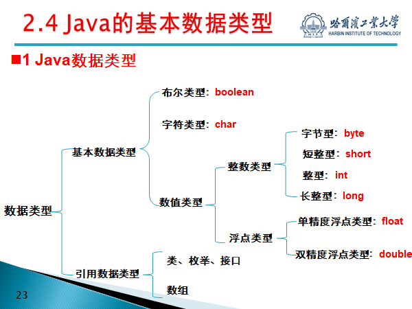

#### 2.4.1.1 boolean

- boolean有两个常量值:false和true，它们全是小写字母，在计算机内用**8位**表示。
- Java是一种严格的类型语言，它**不允许数值类型和布尔类型之间进行转换**。

#### 2.4.1.2 char

- 一个char表示一个Unicode字符，其值用16位无符号数表示
- char类型的常量值必须用一对单引括号(’ ’)括起来

#### 2.4.1.3 整数类型

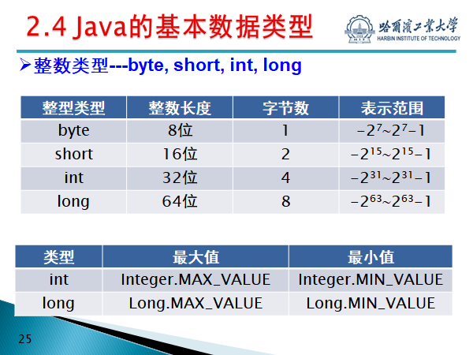

- 整数类型常量可以用十进制、八进制或十六进制形式表示。八进制以0开头，16进制以0x开头
- 默认为int型，若想表示long型**必须加l**

#### 2.4.1.4 浮点型

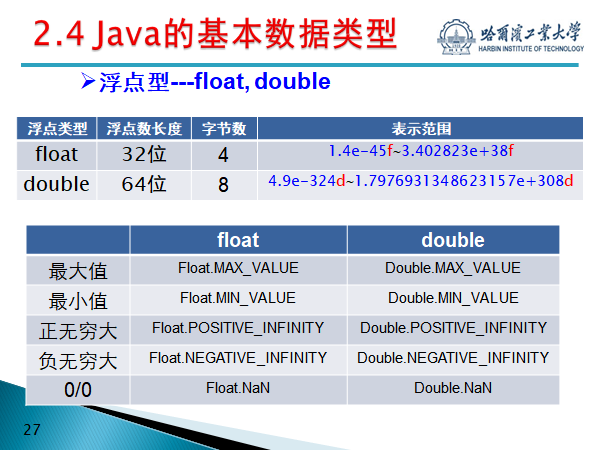

- 整型0/0会报错，浮点型不会
- 默认为double，若想用float**必须加f**

#### 2.4.2 类型转换

- 自动转换：位数少的类型转换向位数多的类型转换为自动转换
- 强制转换：
  - 位数多的类型向位数少的类型进行转换需要进行强制转换。
  - 高级类型(位数较多的数据类型)转换为低级类型(位数较少的数据类型)时，截断高位内容，因此会导致精度下降或数据溢出。


### 2.5 类与对象的初步介绍

#### 2.5.1 面向对象语言的初步发展

- Simula
  - 面向对象技术最早是在编程语言Simula中提出的，Simula语言是Simula I和Simula 67两个语言的统称。**Simula 67语言是被公认的最早的面向对象语言**，**但它的实现不是很完整。**
  - Simula虽然最早提出对象的概念，但因为其自身复杂，比较难学，而没有大规模流行。但Simulat提出的面向对象的概念对程序语言后继的发展产生了巨大和深远的影响。
- Smalltalk
  Smalltalk是公认为历史上第二个面向对象的程序语言，而且是**第一个完整实现了面向对象技术的语言**。

- C++:是**第一个大规模使用**的面向对象语言

#### 2.5.2 面向对象概述

##### 2.5.2.1 基本概念

- 对象：对象是对现实世界中个体或事物的抽象表示，是它的**属性(数据)和相关操作(方法)的统一封装体**。
- 类：类用于表示某些对象的共同特征(属性和操作)，对象是类的实例。

##### 2.5.2.2 面向对象特征

- 封装：将数据及对数据的操作捆绑在一起成为类，就是封装。
- 继承：将一个已有类的属性和方法保留，并加上自己特殊的属性和方法，从而构成一个新类，就是继承。原来的类是父类，新类是子类，子类继承或派生于父类。
- 多态：在一个类或多个类(具有父子关系)中，可以让多个方法使用同一个名字，从而具有多态性。

##### 2.5.2.3 面向对象语言五个基本特征

- 万物皆对象
- 程序是对象的集合，他们通过发送消息来告诉彼此所要做的
- 每个对象都有他们自己的有其他对象所构成的存储。即可以通过创建包含现有对象的包的方式来创建新类型的对象  
- 每个对象都拥有其类型。
- 某一特定类型的所有对象都可以接收同样的消息

##### 2.5.2.4 与类有关的关键字

- 限定访问权限的修饰符
  - public：用public修饰的成分表示公有的，它可以被其它**任何对象**访问。
  - private：类中限定为private的成员只能被**这个类本身**访问，在类外不可见。
  - protected：用该关键字修饰的成分是受保护的，只可以被**同一包及其子类的实例对象**访问。
  - 没有修饰：如果没有访问修饰符，则表示friendly，相应的成分可以被**所在包中的各类**访问。

| **类型**         | **无修饰符** | **private** | **protected** | **public** |
| ---------------- | ------------ | ----------- | ------------- | ---------- |
| 同一类           | 是           | 是          | 是            | 是         |
| 同一包中的子类   | 是           | 否          | 是            | 是         |
| 同一包中的非子类 | 是           | 否          | 是            | 是         |
| 不同包中的子类   | 否           | 否          | 是            | 是         |
| 不同包中的非子类 | 否           | 否          | 否            | 是         |

- 存储方式修饰符---static
  - static既可以修饰类的属性(静态属性)，也可以修饰类的方法(静态方法)。
  - 静态成员与类相对应，它可以被类的**所有对象**共享。
  - 静态成员可以使用类名直接访问，也可以使用对象名进行访问。、
  - 静态方法不需要实例化即可调用，不能有this，不能访问非静态成员变量和非静态方法，但是非静态成员变量和非静态方法可以访问静态方法。
  - 例子： 静态方法与变量

- 与继承有关的关键字
  - extends：继承关系用extends表示。
  - final：用final修饰的类不能再派生子类，它已达到类层次中的最底层。修饰的方法不能被重写。final 修饰变量，则该变量的值只能赋一次值，即常量
  - abstract：用abstract修饰的类或方法，表示被修饰的成分是抽象的。抽象方法只须给出原型说明，方法体是空的，含有抽象方法的类必须说明为抽象类。不能创建抽象类的实例。
  - this：指代本类。
  - super：指代父类。

#### 2.5.3 创建对象

- Java对类类型变量的内存分配步骤：
  - 对象引用：在内存中为其建立一个引用，并置初值null，表示**不指向任何内存空间**。
  
  - 对象实例化：用new申请相应的内存空间，内存空间的大小依class的定义而定，并将该段内存的首地址赋给刚才建立的引用。
  
  - Java把说明为class类型的变量看作是引用
  
  - 例子见 引用理解
  
    

## 3表达式与流程控制

### 3.1 表达式

- 表达式：由**运算符和操作数**组成，对操作数进行运算符指定的操作，并得出一个结果

#### 3.1.1操作数

- 常量：

  - 在Java语言中，主要是利用final关键字来进行常量定义，当常量被定义后，是不允许修改的。
  - final和static同时使用：多个对象中的值是相同的。只加final由于初始化情况不同不同对象中的值可能也不相同。

- 变量：

  - 变量是存储数据的基本单元，它可以用作表达式中的操作数，变量在使用前先要说明

  - 初始化：若不给定值，系统按照如下值进行初始化

    | **类型**     | **初始值**     |
    | ------------ | -------------- |
    | byte         | (byte)0        |
    | short        | (short)0       |
    | int          | 0              |
    | long         | 0L             |
    | float        | 0.0f           |
    | double       | 0.0            |
    | char         | ‘\u0000’(null) |
    | boolean      | false          |
    | 所有引用类型 | null           |

  - 作用域：

    - 类中定义成员变量的作用域是整个类。
    - 方法中定义的局部变量的作用域是从该变量的说明处开始到包含该说明的语句块结束处，块外是不可使用的。
    - 块内说明的变量将屏蔽其所在类定义的同名变量。但是同一块中如果定义两个同名变量则将引起冲突。

#### 3.1.2 运算符

- 算术运算符

- 关系运算符

- 逻辑运算符

- 位运算符

  - 位运算符用来对二进制位进行操作，包括按位取反(~)、按位与(&)、按位或(|)、异或(^)、右移(>>)、左移(<<)及无符号右移(>>>)，
  - 位运算只能对整型和字符型数据进行操作。
  - **注：**计算机中使用的是补码存储！！！
  - 负数的补码：符号位为1，其余位为该数绝对值的原码按位取反，然后整个数加1。
  - 整数的补码：与原码相同。每一位都要与

- 条件运算符：

  - 表达式?语句1:语句2；
  - 表达式得到一个逻辑值，根据该值得真假决定执行什么操作。如果为真(true)，执行语句1，否则执行语句2 

- 转换原则：低可以转高，但高不可以转低

  

#### 3.1.3 数学函数

Math.random(). 返回0.0到1.0之间双精度的一个随机数

得到一个[min,max)之间的数;

```java
public static int getRandomInt(int min, int max) {
        return (int)(Math.random()*(max-min)+min); //不含最大值，含最小值
    }
```

### 3.2 控制流

#### 3.2.1语句

- 语句是Java的最小执行单位
- 分为简单语句和复合语句，复合语句就是花括号括起来的语句组，也称作快

#### 3.2.2 控制语句

- if语句
- switch语句
  - 表达式的计算结果必须是byte, short, int, char型或枚举类型。
  - Java规定switch语句不允许使用浮点型或long型表达式。
  - default语句可选

#### 3.2.3 循环语句

- for语句：for循环语句适用于明确知道重复执行次数情况

  for循环的执行流程：
  1)第一次进入for循环时，对循环控制变量赋初值；
  2)根据判断条件的内容检查是否要继续执行循环，如果判断条件为真，继续执行循环，如果条件为假，则结束循环执行下面的语句。
  3)执行完循环体内的语句后，系统会根据循环控制变量的增减方式，更改循环控制变量的值，再回到步骤2重新判断是否继续执行循环。

- while循环结构语句

- do while循环结构语句：它总是先执行一次循环体，然后判断条件表达式的值是否为真，若为真，则继续执行循环体；否则循环执行结束

#### 3.2.4转移语句

- break
  - break语句可用于switch语句，for、while及do等循环语句和块语句中。
  - 在switch语句及循环语句中，break的语义是跳过本块中余下的所有语句，转到块尾，执行其后的语句。
  - 在循环语句中，可以用break语句强行退出循环，继续执行循环体外的下一个语句，如果break出现在嵌套循环中的内循环，则break语句**只会退出当前一层循环**。
  - **标签：**在块中和标号配合使用，语法格式为：break 标号；**其语义是跳出标号所标记的语句块，继续执行其后的语句。**
- continue
  - 立即结束当次循环而执行下一次循环
  - continue语句可以和标号一起使用，其语法格式为：continue 标号; 它立即结束标号标记的那重循环的当次循环，开始执行下一次循环

## 4 数组、枚举、字符串、容器

### 4.1 数组

- Java将数组作为对象来处理

#### 4.1.1 一维数组的定义

```java
type arrayName[];
Type[] arrayName;
```

- 定义并不会为数组元素分配内存，因此[] 中不需要指出数组长度。
- 这只是个引用，并不会真正分配内存空间。

#### 4.1.2 一维数组的创建

非为静态初始化和动态初始化

- 静态初始化：定义数组的同时对数组元素进行初始化。
- 动态初始化：使用运算符new为数组分配空间，数组说明的方括号中的数字表示数组元素个数。

```java
String[] names=new String[3];
names[0]=“Zhang”; 
names[1]=“Li”;
names[2]=“Wang”;
//等价于
String names[]={“Zhang”, “Li”, “Wang” };

```

#### 4.1.3复合类型数组

复合类型数组使用运算符new为只是为数组本身分配空间，并没有对数组的元素进行初始化。对于复合类型的数组，需要经过两步进行空间分配：

```java
	type arrayName[]=new type[arraySize];//创建数组本身

	arrayName[0]=new type(paramList);
    arrayName[1]=new type(paramList);
    ……
    arrayName[arraySize-1]=new type(paramList); //创建各个数组元素
```

#### 4.1.4 数组比较

数组属于引用型变量，因此两个相同类型的数组如果具有**相同的引用**，它们就有完全相同的元素。

即引用相等表示他们指向同一个数组。

#### 4.1.5 数组的遍历

- 循环遍历

- toString()方法遍历

  ```java
  Arrays.toString(arrayName);
  ```

#### 4.1.6 多维数组

```java
//定义
int intarray [][];
int	[][] intarray;

//动态初始化
//方法1：直接为每一维分配空间
int[][] intArray=new type[arraylength1][arraylength2];
//方法2：多维数组可以从高维起，分别为每一维分配内存。
type arrayN[][]=new type[arraylength1][];
arrayN[0]=new type[arraylength2];
arrayN[1]=new type[arraylength2];
…
arrayN[arraylenth1-1]=new type[arraylength2];
//即除了最后一维可以不给定长度，其他必须给定长度，且可以生成不同长度的低维数组
```

#### 4.1.7 数组复制

System

```java
public static void arraycopy(sourceArray, //源数组
                             int index1, //起始位置
                             copyArray, //目标数组
                             int index2,//目标数组起始位置
                             int length)//长度
    //如果放不下报异常
```

```java
Arrays类
public static type[] copyOf(type[] original, int newLength)
//生成一个内容为orginal，长度为newLength的新数组
```

```java
public static type[] copyOfRange(type[] original, int from, int to)
//将参数original指定的数组中从索引from至to-1的元素复制到一个新数组中，并返回这个新数组
```


### 4.2 枚举

```java
enum 枚举名
{
      常量列表
}
```

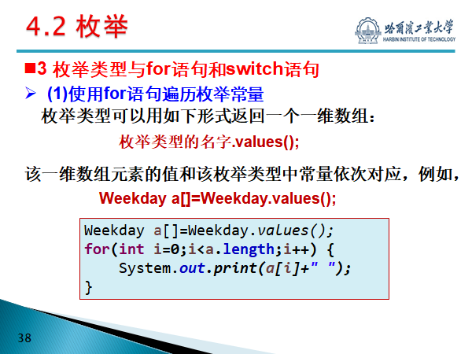

### 4.3 字符串

- String为不变字符串，StringBuffer为可变字符串
- 常用方法：
  - length()：返回字符串中的字符个数。
  - charAt(int index)：返回字符串中index位置的字符。
  - toLowerCase()：将当前字符串中的所有字符转换为小写形式。
  - toUpperCase()：将当前字符串中的所有字符转换为大写形式。
  - subString(int beginIndex)：截取当前字符串中从beginIndex开始到末尾的子串。
  - subString(int beginIndex, int endIndex)：截取当前字符串中从beginIndex开始到endIndex结尾的子串。
  - replace(char oldChar, char newChar)：将当前字符串中出现的所有oldChar转换为newChar。

### 4.4 容器

- Collection接口：存放独立元素的序列。

- Map接口：存放key-value型的元素对。

- 常用的容器：
  
  - Vector
  
  - LinkedList：其数据结构采用的是链表，此种结构的优势是删除和添加的效率很高，但随机访问元素时效率较ArrayList类低。
  - ArrayList：其数据结构采用的是线性表，此种结构的优势是访问和查询十分方便，但添加和删除的时候效率很低。
  - HashSet：不允许其中存在重复的元素，无法添加一个重复的元素，利用Hash函数进行了查询效率上的优化。
  - HashMap：提供了key-value的键值对数据存储机制，可以十分方便的通过键值查找相应的元素，而且通过Hash散列机制，查找十分方便。

#### 4.4.1 迭代器

- boolean hasnext(); //检查序列中是否还有元素
- Object next(); //获得序列中的下一个元素
- void remove(); //将迭代器中当前元素删除


## 5 对象和类进阶

### 5.1 抽象数据类型

- 是指基于一个逻辑类型的数据类型以及这个个类型上的一组操作。
- Java只“按值”传送自变量，即方法调用不会改变自变量的值。
- 重载方法名：Java允许对多个方法使用同一个方法名，这就是方法名的重载。方法重载允许Java在同一个类中定义相同的方法名，但需要具有不同的参数表（参数个数或者参数名不同）。

### 5.2 对象的构造和初始化

- 构造方法：
  - 构造方法的名字与类名相同。
  - 没有返回类型。
  - 通常要说明为public类型，即公有的。
  - 可以按需要包含所需的参数列表。
  - **构造方法不能继承。**

###  5.3 this引用

- this引用对象自身，常用在引用隐藏数据域，调用构造方法。
- static方法中不能出现this

### 5.4 子类

- **“is a”关系**

- extends关键字，object类为所有类的父类

- 继承父类的属性在子类中不用定义，可以直接使用。

- Java只允许单继承

- 多态性：同一名字的若干个方法，有不同的实现(放方法体中的代码不一样)。通过重载或者重写实现（final 方法不能被重载或者重写）

- **动态绑定：**假设对象o是类C1,C2,…,Cn-1和Cn的实例，其中，C1是C2的子类，C2是C3的子类，…，Cn-1是Cn的子类，如果对象o调用一个方法m，Java虚拟机依次在类C1,C2,…,Cn-1,Cn中查找方法m的实现，直到找到为止。**即从子类逐个向父类寻找，调用找到的第一个**

- 异类集合：异类集合是由不同质内容组成的集合，也就是说，集合内所含元素的类型可以不完全一致。

  ```java
  A[] abcdef=new A[7];//设置类型时必须为父类的
  //此时只是一个数组，里面7个A引用，值为null
  abcdef[0]=new A();
  abcdef[1]=new B();
  abcdef[2]=new C();
  abcdef[3]=new D();
  abcdef[4]=new E();
  for(int i=0;i<5;i++)
  	{        
  		abcdef[i].printf();
  	}
  
  ```

- 由于类的多态性，类的变量既可以指向本类实例，又可以指向其子类的实例。在程序中，有时需要判明某个引用到底指向哪个实例，这可以通过**instanceof**运算符来实现。

  ```java
  class A
  {
      void printf()
      {
          StdOut.println("A");
      }
      void printf(A e)
      {
          if (e instanceof B)
          {
              StdOut.println(e.getClass()+"is b");
          }
          else if(e instanceof C)
          {
              StdOut.println(e.getClass()+"is c");
          }
  
      }
  
  }
  
  //main函数
  A a=new A();
  a.printf(b);
  a.printf(c);
  ```

  即父类中的一个方法接受他的不同的子类的成员，然后判断到底是哪个子类的

- 转换对象：Java允许使用对象之父类类型的一个变量指示该对象，称为转换对象，但不允许子类指向父类。

### 5.5 方法重写

- 子类重写父类方法的情况：

  - 子类要做与父类不同的事情；
  - 在子类中取消这个方法；
  - 子类要做比父类更多的事情。

- 如果子类已经重写了父类中的方法，但在子类中还想使用父类中被隐藏的方法，可以使用super关键字。

- 方法重写的规则

  - 重写方法的允许访问范围不能小于原方法。
  - 重写方法所抛出的异常不能比原方法更多

- **父类构造方法调用**  

  - Java要求一个父类的对象要在子类运行前完全初始化。

  - super关键字也可以用在构造方法中，其功能为调用父类的构造方法。

  - **如果在子类的构造方法的定义中没有明确调用父类的构造方法，则系统在执行子类的构造方法时会自动调用父类的构造方法(无参数的构造方法)。**

  - **如果在子类的构造方法的定义中调用了父类的构造方法，则调用语句必须出现在子类构造方法的第一行。**

    ```java
    public class TestD
    {
        public static void main(String[] args)
        {
            method(new B());
            method(new A());
        }
    
        public static void method(A a)//只是生成引用，跟调用谁的函数和构造函数无关
        {
            a.print();
        }
    }
    
    class A
    {
        int data;
    
        public A()
        {
            add(2);
        }
    
        public A(int k)
        {
            add(k);
        }
    
        public void add(int i)
        {
            data += i;
        }
    
        public void print()
        {
            System.out.println("data=" + data);
        }
    }
    
    class B extends A
    {
        public B()
        { 
            //super(1);
            add(1);
    
        }
    
        public void add(int i)
        {
            data += i * 3;
        }
    }
    ```

    method(new B())详解：

    B()继承A，故先隐式调用A的无参构造函数，执行add(1)，此时执行的是重写的add（1），故data=2*3=3；然后再执行add（1），结果为9，若加上super（9），则调用有参构造函数。

    method(new A())详解：

    直接调用A的构造函数和add函数。

    **即：**new的是谁就调用谁的方法，即使是在子类中调用父类的构造函数也是调用重写的方法（动态绑定）

  

### 5.6 Java包

- 一个Java源代码文件称为一个编译单元。
- Java语言规定，一个编译单元中只能有一个public类，且该类名与文件名相同。
- 编译单元中的其它类是该public类的支撑类。
- 经过编译，编译单元中的每个类都产生一个.class文件。
- Java的工作程序是一系列的.class文件，Java解释器负责寻找、加载和解释这些文件。
- 包是类的容器，包的设计人员利用包来划分名字空间，用于分隔类名空间，以避免类名冲突。
- 通常包名中全部用小写字母。

### 5.7 类成员

如果类中包含类成员(类变量/类方法)，系统只在实例化该类的第一个对象的时候，为类成员分配内存，以后再生成该类得实例对象时，将不再为类成员分配内存，不同对象的类变量将共享同一内存空间。

#### 5.7.1 类变量（静态变量）与类方法（静态方法）

- 被所有的类成员所共享，不依赖于实例。
- 类方法不允许使用this和非静态成员变量。

### 5.8 关键字final

- final可以修饰类或类的成员(成员变量或成员方法)。
- 一个方法被定义为final，则不能被重写，
- 如果一个类被定义为final，它不能有子类。
- 被标记为final的变量称为终极变量。终极变量是一个常量，企图改变终极变量的取值将会引起变异错误。

### 5.9 抽象类

- 可以通过关键字abstract把一个类定义为抽象类。

- 在抽象类中，每一个未被定义具体实现的方法也标记为abstract，称为抽象方法。

- 抽象类不能被直接实例化，他的子类可以。

- 抽象类可以包含抽象方法和非抽象方法，反之，不能在非抽象类中声明抽象方法，即只有抽象类才能具有抽象方法。

  

### 5.10 接口

- 接口允许创建者规定一个类的基本形式，包括方法名、自变量列表以及返回类型，但不规定方法主体。

- 在接口中所有的方法都是抽象方法体。

- Java允许一个类实现(implements)多个接口，从而实现比多重继承更加强大的能力。

- **接口也具有数据成员与方法，但数据成员一定要赋初值，且此值不能再更改，而方法必须是“抽象方法”。**

  ```java
  interface Storage
  {
      int num = 10;
  
      void setNum(int a);
  
      void setNum();
  
      void printf();
  }
  
  public class Interface implements Storage
  {
  
      int a;
      @Override
      public void setNum(int a)
      {
          this.a=a;
      }
  
      @Override
      public void setNum()
      {
          a=num;
      }
  
      @Override
      public void printf()
      {
          StdOut.println(a);
      }
      public static void main(String[] args)
      {
          var t=new Interface();
          t.printf();
          t.setNum();
          t.printf();
          t.setNum(23);
          t.printf();
      }
  } 
  ```

  

### 5.11 内部类

#### 5.11.1 成员类

- 成员类是在封装类或封装接口中作为成员声明的类。

- 成员类包含非静态成员类和静态成员类。

- 非静态成员类：

  - 非静态成员类中**不能定义静态变量和方法**。
  - 非静态成员类可以访问封装类的所有成员。
  - 在非静态成员类中访问封装类的成员时，若封装类的成员与成员类的成员不重名，则可以直接用成员名进行访问；若封装类与成员类的成员的成员重名，访问封装类实例成员的语法为：封装类类名.this.封装类实例成员名;
  - 在封装类之外创建非静态成员类实例时，**需要先创建封装类的实例**，然后使用以下语法创建非静态成员类实例：封装类类名.非静态成员类类名 实例变量名=封装类实例成员名.new 非静态成员类类名;

- 静态成员类：

  - 静态成员类中既可以**定义静态成员，也可以定义非静态成员**。

  - 静态成员类中能直接访问封装类的所有静态成员，但**不能直接访问封装类的非静态成员**。

  - 在静态成员类中访问封装类的成员时，若封装类的成员与成员类的成员不重名，则可以直接用成员名进行访问；若封装类与成员类的成员的成员重名，访问封装类静态成员的语法为：封装类类名.封装类静态实例成员名;

  - 在封装类之外创建静态成员类实例的语法为：封装类类名.静态成员类类名 实例变量名= new 封装类类名.静态成员类类名;**不需要先创建封装类的实例。**

  - 在封装类之外访问静态成员类的静态成员时，需要用封装类的名称作为前缀，语法如下：封装类类名.静态成员类类名.静态成员名;

    ```java
    public class TTest
    {
        static class fuck
        {
            static void print()
            {
                StdOut.println("我是静态成员类");
            }
        }
    
        public static void main(String[] args)
        {
            TTest.fuck hehe=new TTest.fuck();
            hehe.print();
            TTest.fuck.print();
        }
    }
    ```

    

#### 5.11.2 *局部类*

- 局部内部类是在**封装类的方法中**定义的内部类，与局部变量类似，其作用域是定义它的代码块。
- 局部类的类名**不能与其封装类重名**。
- 局部类可以是abstract和final型，**访问修饰符只能是缺省的**，不能是public、private或protected。
- 局部类中**不允许包括静态成员(变量和方法)**。
- 在局部类中**只能访问它所在方法中的final型变量，不能访问非final型的变量**。
- 不能在封装类之外创建局部类的实例。
- 在局部类中可以访问封装类的成员，如果封装类成员与局部类成员重名，实例成员：封装类类名.this.封装类实例成员名，静态成员：封装类类名.封装类实例成员名;

#### 5.11.3 匿名类

- 匿名类是指没有名称的类，这个类实现的功能比较简单，或者在程序中只使用一次，就可以用匿名类的方式创建这个类的实例
- new 匿名类类名或接口名(){
          类体;
  }
- 匿名类必须是一个具体的对象，**不允许是abstract的，也不可以是static**。
- 匿名类本身没有名字，所以**没有构造方法**，只能用super关键字调用其父类的构造方法。
- 匿名类**只能是final型的，其中包括的所有变量和方法都是final型的**，即无法被继承。

#### 5.11.4 成员接口

- 成员接口是指在封装类或封装接口中声明的接口。
- 当一个接口被嵌套在一个类中时，该接口修饰符可以是public、private和缺省的，private接口只能在封装类的内部实现和使用。
- **当一个接口被嵌套在一个接口中时，成员接口自动拥有封装接口访问范围，可以在外部加以实现。**


### 5.12 范型（类似typename）

修饰符] [static] [final] [abstract] class 类名<类型参数表> 
                               [extends 父类名] [implements 接口名]{
         类体;
}

- 如果一个类或接口包含了一个或多个类型变量，则称该类或接口为范型类或范型接口
- 参数列表可以包含若干个表示类型的参数，多个参数之间用逗号分隔。
- 类型参数可以使用任何字符串，通常约定使用大写字母，
- 创建范型类的具体实例，必须用具体的数据类型来替换类定义中的类型参数表中的范型类型并用尖括号括起
- 有界类型参数：在特定的应用中，可能希望**定义的范型是某个类或其子类类型**，而不是全部的子类类型，这种有所限制的范型称为有界范型。定义：<T extends 类名或接口名>;

## 6.异常

- 异常(Exception)是正常程序流程所不能处理或没有处理的异常情况或异常事件
- 按照异常在**编译时是否被检测**来分，异常可分为受检异常(Checked Exception)与非受检异常(Unchecked Exception)。非受检异常：在编译时不能被Java编译器检测到。非受检异常包括运行yan时异常(Runtime Exception)和错误(Error)。
- 根据**异常的严重性**，异常又可以分为程序可以处理的异常和错误异常。
  - 程序可处理异常：程序可处理的异常是非致命性的，通过某种修正后程序还能继续执行，这类异常也称为例外。可处理异常借助于程序员的干涉是可以恢复的。
  - 错误异常：错误异常是致命性的，不能简单地恢复执行。


### 6.1 基本概念

- 异常对象：在一个方法运行过程中，如果发生了异常，称程序产生了一个异常事件，相应地生成异常对象。这个对象中包含了该异常必要的详细信息，包括所发生的异常事件类型及异常发生时程序的状态。
- 抛出异常：我们将生成异常对象并把它提交给运行时系统的这一过程称为抛出(throw)一个异常。
- 捕获：异常发生时，Java运行时系统从生成对象的代码块开始进行回溯，沿方法的调用栈逐层回溯，寻找相应的处理代码，直到找到包含相应异常处理的方法为止，并把异常对象交给方法处理，这一个过程为捕获。

- 异常的处理借助于调用堆栈按先近后远的原则进行。

### 6.2 异常处理

- 异常处理：对所发生的异常进行的处理。

- 异常处理的方式有两种：**捕获异常和转移异常。**

  - 捕获异常：通过try-catch-finally结构处理，格式如下

    ```java
    try{
             //此处为抛出具体异常的代码
         }catch(ExceptionType1 e){
             //抛出ExceptionType1异常时要执行的代码
         }catch(ExceptionType2 e){
              //抛出ExceptionType2异常时要执行的代码
          } 
          ……
          catch(ExceptionTypek e){
               //抛出ExceptionTypek异常时要执行的代码
          }finally{
               //必须要执行的代码
          }
    }
    
    ```

  - 转移异常：程序不在当前方法内处理异常，而是把异常抛出到调用方法中。

    ```java
    <访问权限修饰符><返回值类型><方法名>(参数列表) throws 异常列表{
         方法体；
    }
    ```

    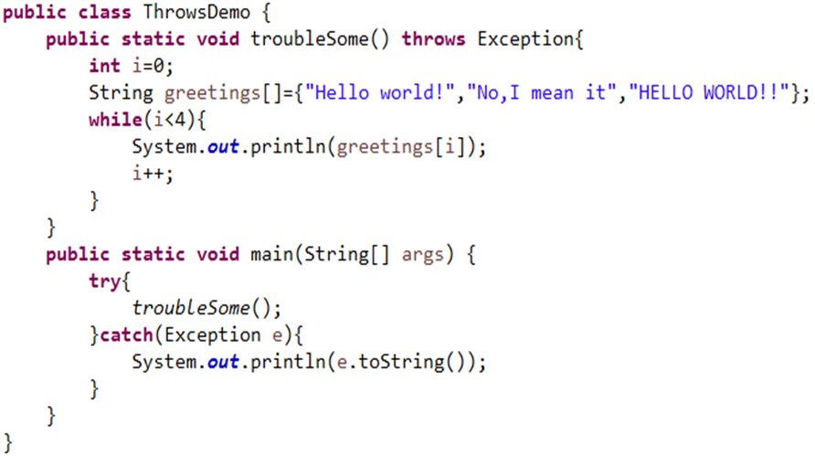

- 	public String toString()//使用getMessage()的结果返回类的串级名字。

  

## 7Swing

### 7.1 AWT与Swing

- AWT和Swing区别
  - **AWT**是基于本地方法的C/C++程序，其**运行速度比较快**，**Swing**是基于AWT的Java程序，其**运行速度比AWT要慢。**
  - AWT的控件在不同的平台可能表现不同，而**Swing在所有平台表现是一致的。**
  - **Swing要比AWT拥有更多的功能**。由于Swing是在AWT基础上扩展而来的，因此Swing依赖于AWT顶层容器，除此之外，Swing几乎实现了所有平台上的标准组件。
- 组件
  - 组件：组件是指构成图形界面的元素，在Java中用类表示，如按钮(JButton)、标签(JLabel)、列表(JList)和文本框(JText)等。
  - 组件分类
    - 基本组件：不包含其它组件的组件称为基本组件或者原子组件。
    - 容器组件：包含其它组件的组件称为容器组件，或简称为容器。容器又可以进一步分为顶层容器和非顶层容器(中间容器)。

### 7.2 容器

```java
public static void main(String[] args) {
    //我也不知道是啥东西，但是写上就不会出问题了
        EventQueue.invokeLater(() -> {
            //所有的框架类在这里新建
            CalculatorFrame frame=new CalculatorFrame();
        });
    }

class Frame extends JFrame
{
	//定义框架的默认像素
	private final int screenHeight；
    private final int screenWidth；
	public Frame(	)
	{
	//可选，可以获得当前屏幕的分辨率信息
	Toolkit kit = Toolkit.getDefaultToolkit();
    Dimension screenSize = kit.getScreenSize();
    screenHeight = screenSize.height;
  	screenWidth = screenSize.width;
    //设置默认的大小
    setSize(screenWidth / 4, screenHeight / 2);
    //或者使用自适应大小
    pack();
    //设置位置是否随平台改变
    setLocationByPlatform(true);
    //设置标题
    setTitle("CZY's small calculator");
    //设置关闭按钮行为
    setDefaultCloseOperation(JFrame.EXIT_ON_CLOSE);
    //可见性设定，一定放在最后
    setVisible(true);
	}
	//以上内容也可以不写在构造函数中，而是通过访问对象来设置。
}
```


#### 7.2.1 顶层容器

- 默认布局管理器为BorderLayout

- JFrame：是一个带有标题行和控制按钮(最小化、恢复/最小化、关闭)的独立窗口，创建应用程序时需要使用JFrame。
- JApplet：创建小应用程序时使用JApplet，它被包含在浏览器窗口中。
- JDialog：创建对话框时使用JDialog。
- JWindow：是一个不带有标题行和控制按钮的窗口。

#### 7.2.2 内容窗格

- 每个**顶层容器**都有一个内容窗格(ContentPane)，顶层容器中除菜单之外的组件都放在这个内容窗格中。

- 将组件放进内容窗格方法：

  - 直接用frame.add()
- 使用内置的container
  
  ```java
    Container contentPane=frame.getContentPane();
    contentPane.add(button, BorderLayout.CENTER); 
  ```

- 创建新的内容窗格取代顶层容器默认的内容窗格。 

  ```java
  //创建一个JPanel实例
  JPanel contentPane=new JPanel();
  //设置JPanel实例的布局管理器
  contentPane.setLayout(new BorderLayout());
  //将Button组件实例添加到JPanel实例中
  contentPane.add(button, BorderLayout.CENTER);
  /**通过顶层容器的setContentPane方法将JPanel实例设置为新的内容窗格**/
  frame.setContentPane(contentPane); 
  ```

#### 7.2.3 面板JPanel

- 面板属于中间容器，不能独立存在但可以嵌套，面板必须被添加到其他容器内部。
- 默认布局管理器为FlowLayout

### 7.3 布局管理器

通过容器的**setLayout()**方法改变容器的布局管理器。

#### 7.3.1FlowLayout

- 对容器中组件进行布局的方式是将组件逐个地安放在容器中的一行上，一行放满后就另起一个新行。

- JPanel的默认布局管理器

- ```java
  setLayout(new FlowLayout(int align, int hgap, int vgap));
  add(button);
  ```
- align设定组件的对齐方式，取值有FlowLayout.LEFT、FlowLayout.RIGHT和FlowLayout.CENTER三种方式，分别表示左对齐、右对齐、居中。

- hgap和vgap设定组件的水平和垂直间距。

#### 7.3.2BorderLayout

- BorderLayout是顶层容器中内容窗格的默认布局管理器，每个由BorderLayout管理的容器被划分成北(North)、南(South)、西(West)、东(East)、中(Center)五个区域，在每个区域可以加入一个组件。

- ```java
  setLayout(new BorderLayout(int hgap, int vgap));
  add(button,BorderLayout.SOUTH);//组件添加位置
  ```

- hgap和vgap设定组件的水平和垂直间距。

#### 7.3.3GridLayout

- GridLayout是一种网格式的布局管理器，它将容器空间划分成若干行乘若干列的网格，组件依次放入其中，每个组件占据一格。

- ```java
  setLayout(new GridLayout(int rows, int cols, int hgap, int vgap));
  add(button)
  ```

- rows和cols分别指定网格的行数和列数。
  hgap和vgap分别表示网格间的水平间距和垂直间距。

#### 7.3.5 CardLayout

- 卡片式布局管理器，它将容器中的组件处理为一系列卡片，每一时刻只显示出其中的一张。

#### 7.3.5BoxLayout

- 它将容器中的组件按水平方向排成一行或按垂直方向排成一列。当组件排成一行时，每个组件可以有不同的宽度；当组件排成一列时，每个组件可以有不同的高度。

- ```java
  setLayout(new BoxLayoutLayout(Container target, int axis));
  add(button);
  ```

- target指明是为哪个容器设置此布局管理器；

- axis指明组件的排列方向，**BoxLayout.X_AXIS、BoxLayout.Y_AXIS**分别表示按水平方向排列和按垂直方向排列。

### 7.4 事件处理

- 事件是用户在界面上的一个操作（通常使用各种输入设备，如：鼠标、键盘等来完成）。

- 事件源：产生事件的组件叫事件源

- 事件处理器（事件处理方法）：事件处理器是一个接收事件对象并进行相应处理的方法。事件处理器包含在一个类中，这个类的对象负责检查事件是否发生，若发生就激活事件处理器进行处理。

- 事件监听器类：

  - 包含事件处理器，并负责检查事件是否发生，若发生就激活事件处理器进行处理的类叫做事件监听器类，其实例就是事件监听器对象。
  - 事件监听器类必须实现事件监听器接口或继承事件监听器适配器类。
  - 事件监听器接口定义了处理事件必须实现的方法。
  - 事件监听器适配器类是对事件监听器接口的简单实现，目的是为了减少编程的工作量。

- 注册事件监听器：必须在事件源上注册事件监听器。这是通过使用事件源组件的以下方法来完成的：
  addXxxListener（事件监听器对象）

- 事件监听器需要包括以下两部分内容

  ```java
  public class MyListener implements ActionListener
      {
  
          @Override
          public void actionPerformed(ActionEvent e)
          {
              //do something
          }
      }
     
  
  然后，在一个或多个组件上可以进行监听器类的实例的注册。如：
      组件对象.addActionListener(MyListener对象); 
  //对于只有一个动作的监听器可以用lambda表达式
  exitButton.addActionListener(event()->｛System.exit(0)});
  ```

  

### 7.5 按钮

```java
//普通按钮
Jbutton(String text, Icon icon);

//切换按钮(JToggleButton)
JToggleButton(String text, Icon icon,boolean selected默认状态);
isSelected();//判断是否被选中

//复选按钮(JCheckBox)及单选按钮(JRadioButton)
//第一个是方形的，第二个是圆形的，别的一样
//不分组可以多选，分组后组内只能单选，不同组可以多选
ButtonGroup g1=new ButtonGroup( );
JCheckBox f=new JCheckBox("f");
g1.add(f);        

```

### 7.6 复选框 **JComboBox**  

- 对于不可编辑的JComboBox，用户只在能在现有的选项列表中进行选择。

- 对于可编辑的JComboBox，用户既可以在现有选项中选择，也可以输入新的内容。

- setEditable(boolean)设置是否可编辑，默认是不可编辑的。

  ```java
  JComboBox<String> jcb1;
  String[] itemList={“One”,”Two”,”Three”,”Four”,”Five”};
  jcb1=new JComboBox(itemList);
  jcb1.setSelectedIndex(1);//选择条目
  jcb1.setVisible(true);//是否可以编辑
  jcb1.getSelectedItem().toString();//得到选择的项目
  ```

### 7.7 JList

- 列表(JList)是可供用户进行选择的一系列可选项。

  ```java
  String[] listData={“one”, “two”, “three”, “four”};
  JList jl=new JList(listData);
  ```

- 列表对象本身并不带滚动条，但是当列表可选项较多时，可将列表对象放入JScrollPane中。 

### 7.8 文本组件

```java
//创建一个文本框，其初始内容由参数text指定，首选宽度由参数columns指定，如果参数columns被设置为0，则首选宽度将是组件实现的自然结果。
//一定要设定宽度
JTextField(String text, int columns);
JPasswordFile(int columns);
String s=getText();
setText(" ");
```

### 7.9 菜单组件

```java
//菜单栏是窗口中的主菜单，用来包容一组菜单。
JFrame frame=new JFrame(“Menu Demo”);
JMenuBar mb=new JMenuBar();
frame.setJMenuBar(mb); 
//菜单(JMenu)
JMenu menu1=new JMenu(“File”);
JMenu menu2=new JMenu(“Edit”);
JMenu menu3=new JMenu(“Source”);
mb.add(menu1);
mb.add(menu2);
mb.add(menu3);
//菜单项
JMenuItem mi1=new JMenuItem(“New”, KeyEvent.VK_S);
JMenuItem mi2=new JMenuItem(“Open”);
mi2.setMnemonic(KeyEvent.VK_O);//设置快捷键
JMenuItem mi3=new JMenuItem(“Close”, KeyEvent.VK_C);
menu1.add(mi1);
menu1.add(mi2);
menu1.add(mi3);
```

### 7.10 对话框

- 分为标准对话框和选择对话框
- 对话框为顶层容器，选择附着的frame
- JDialog 默认的弹出对话框
- 确认对话框(showConfirmDialog)：显示问题，要求用户确认(yes/no/cancel)。
- 输入对话框(showInputDialog)：提示用户输入。
- 信息对话框(showMessageDialog)：显示信息，告知用户发生了什么情况。
- 选项对话框(showOptionDialog)：显示选项，要求用户选择。

```java
package PPT7;

import javax.swing.*;
import java.awt.*;

public class Test3
{
    public static void main(String[] args)
    {
        EventQueue.invokeLater(() ->
        {
            MyFrame frame = new MyFrame();
        });
    }

}

class MyFrame extends JFrame
{

    JLabel text;
    public MyFrame()
    {
        setDefaultCloseOperation(EXIT_ON_CLOSE);
        setSize(300, 400);
        setTitle("对话框功能测试");
        add(new MyPanel(), BorderLayout.CENTER);
        add(new TextPanel(), BorderLayout.NORTH);
        //dialog();
        //add(jd); 对话框无需加入，因为他是顶层容器
        setVisible(true);

    }

    class TextPanel extends JPanel
    {
        public TextPanel()
        {
            text = new JLabel("文本显示");
            setSize(300, 200);
            add(text);

        }
    }

    class MyPanel extends JPanel
    {
        public MyPanel()
        {
            JButton b1 = new JButton("show dialog");
            JButton b2 = new JButton("showMessageDialog");
            JButton b3 = new JButton("showConfirmDialog");

            add(b1);
            add(b2);
            add(b3);

            b1.addActionListener((event) -> {
                dialog();
            });

            b2.addActionListener((event) -> {
                messageDialog();
            });
            b3.addActionListener((event) -> {
                confirmDialog();
            });
        }

        void dialog()
        {
            JDialog jd = new JDialog(MyFrame.this, "hehe", true);
            JTextField jt = new JTextField("oh yearrrrrrrrrr");
            jd.add(jt);
             //关闭该对话框进程，但不结束虚拟机
            jd.setDefaultCloseOperation(DISPOSE_ON_CLOSE);
           
            jd.setVisible(true);//顶层容器自己的可视化设置
            //隐藏该对话框，不关闭进程
            //jd.setDefaultCloseOperation(HIDE_ON_CLOSE);
        }

        void messageDialog()
        {
            //通过静态方法实现
            JOptionPane.showMessageDialog(MyFrame.this,
                    "这是消息对话框的内容",
                    "这是消息对话框的标题",
                    JOptionPane.ERROR_MESSAGE);
        }

        void confirmDialog()
        {
            //返回值为选择的选项
            int confirm = JOptionPane.showConfirmDialog(MyFrame.this,
                    "确认对话框信息",
                    "确认对话框标题",
                    JOptionPane.YES_NO_CANCEL_OPTION);
            switch (confirm)
            {
                case JOptionPane.YES_OPTION:
                    text.setText("Yes");
                    break;
                case JOptionPane.NO_OPTION:
                    text.setText("NO");
                    break;
                case JOptionPane.CANCEL_OPTION:
                    text.setText("CANCEL");
                    break;
                case JOptionPane.CLOSED_OPTION:
                    text.setText("CLOSED");
                    break;
                default:
                    text.setText("default");

            }
        }
        
        void showInputDialog()
        {
            String[] selections = new String[]{"first", "second", "third"};
            var select=JOptionPane.showInputDialog(MyFrame.this,
                    "输入选择对话框",
                    "标题栏",
                    JOptionPane.QUESTION_MESSAGE,
                    null,
                    selections,
                    selections[0]
            );
            if (select!=null)
            {
                text.setText(select.toString());
            }
            else
            {
                text.setText("closed");
            }
        }

    }
}
```

- 文件对话框（JFileChooser）

  ```java
  package PPT7;
  
  import javax.swing.*;
  import java.awt.event.ActionEvent;
  import java.awt.event.ActionListener;
  import java.io.File;
  
  public class FileChooser extends JFrame implements ActionListener
  {
      JButton open=null;
      public static void main(String[] args) {
          new FileChooser();
      }
      public FileChooser(){
          open=new JButton("open");
          this.add(open);
          this.setBounds(400, 200, 100, 100);
          this.setVisible(true);
          this.setDefaultCloseOperation(JFrame.EXIT_ON_CLOSE);
          open.addActionListener(this);
      }
      @Override
      public void actionPerformed(ActionEvent e) {
          // TODO Auto-generated method stub
          JFileChooser jfc=new JFileChooser();
          jfc.setFileSelectionMode(JFileChooser.FILES_AND_DIRECTORIES );
          jfc.showDialog(new JLabel(), "选择");
          File file=jfc.getSelectedFile();
          if(file.isDirectory()){
              System.out.println("文件夹:"+file.getAbsolutePath());
          }else if(file.isFile()){
              System.out.println("文件:"+file.getAbsolutePath());
          }
          System.out.println(jfc.getSelectedFile().getName());
      }
  }
  
  ```

  

## 8 数据流

### 8.1 数据流的基本概念

#### 8.1.1 Java的输入、输出机制

- 输入、输出操作
  - 输入操作：计算机（**CPU和存储**）从其他设备中读取数据的操作称为输入操作。
  - 输出操作：计算机向其他设备写出数据的操作称为输出操作。
- 计算机、其他设备
  - 计算机：**计算机指的是CPU和存储的组合；**
  - 其他设备：其他设备有键盘、鼠标、显示器、打印机、磁盘、网络等。

#### 8.1.2 Java数据流传输模式

- 流模式
  Java为了解决数据传输问题，在传输形式上采用**无结构的字节、字符或相同单位的数据序列**，按照**顺序“数据流”**的方式通过某传输媒介实现数据交换。
- 输入流、输出流
  数据流的走向是有方向的—流向，数据流向的确定是相对计算机而言的。**传向计算机的数据流称为输入流，计算机发出的数据流称为输出流。**
- 字节流与字符流
  - 字节流(8位)：针对字节(或ASCII编码的字符)数据流进行传输。
  - 字符流(16位)：针对Unicode编码的字符数据流进行传输。

#### 8.2 基本字节数据流

- InputStream（抽象类）
- OutputStream（抽象类）

##### 8.2.1 标准输入输出流

- 标准输入输出是在命令行方式下的输入输出方式。
- System.in
  System.in是InputStream类型变量，对应于标准输入，主要通过read方法接受键盘输入数据。
- System.out
  System.out是PrintStream类型变量，对应于标准输出，主要通过print和println方法向控制台输出数据。
- System.err
  System.err是PrintStream类型变量，用于向控制台输出错误信息。

```java
package PPT10;

import edu.princeton.cs.algs4.StdOut;

import java.io.*;

public class StandardStream
{
    public static void echoIN()//输入重定向到文件
    {
        try//异常处理不可少
        {
            var in = new FileInputStream("setOut.txt");
            System.setIn(in);
            while (true)
            {
                int i = System.in.read();
                //注意转换
                char c = (char) i;
                if (i == -1)
                {

                    break;
                }
                System.out.print(c);


            }
            in.close();

        } catch (IOException e)
        {
            e.printStackTrace();
        }

    }

    public static void echoOut(String s)
    {
        char[] chs = s.toCharArray();

        try
        {
            var out = new PrintStream("setOut.txt");
            System.setOut(out);
            for (char ch : chs)
            {
                System.out.write(ch);//输出重定向到文件
            }
            // System.out.write(-1);
            out.close();

        } catch (FileNotFoundException e)
        {
            e.printStackTrace();
        }
    }

    public static void main(String[] args)
    {
        echoIN();
        echoOut("test heheda");
    }
}

```

##### 8.2.2 文件数据流

- FileInputStream：用来打开一个输入文件。对于类FileInputStream的实例对象，如果所指定的文件不存在，产生FileNotFoundException异常。
- FileOutputStream：用来打开一个输出文件。对于类FileOutputStream的实例对象，如果所指定的文件不存在，则创建一个新文件。

```java
package PPT10;

import java.io.FileInputStream;
import java.io.FileNotFoundException;
import java.io.FileOutputStream;
import java.io.IOException;
import java.util.Scanner;

public class FilrStream
{
    public static void main(String[] args)
    {
        String filename;
        Scanner input = new Scanner(System.in);
        filename = input.nextLine();
        try
        {
            FileInputStream in = new FileInputStream(filename);
            
            StringBuffer s = new StringBuffer();
            FileOutputStream out = new FileOutputStream(filename + ".c");
            
            //Scanner方法读取
            Scanner fileInput=new Scanner(in);
            while(fileInput.hasNextLine())
            {
                s.append(fileInput.nextLine());
            }

            //read方法读取
            while (true)
            {
                int i = in.read();
                if (i == -1)
                {
                    break;
                }
                s.append((char) i);
            }
            System.out.println(s);
			//转为byte数组
            byte b[] = s.toString().getBytes();
            //写法1
            for (var i : b)
            {
                out.write(i);
            }
            //写法2
            out.write(b, 0, b.length);

            in.close();
            out.close();
        } catch (IOException e)
        {
            e.printStackTrace();
        }

    }
}

```

##### 8.2.3 （过滤器）缓冲区数据流

- 增加缓冲区流，减少访问硬盘的次数，提高效率！
- 包括BufferedInputStream和BufferedOutputStream，它们都是过滤器数据流，都是在数据流上增加了一个缓冲区。
- 当读写数据时，数据以块为单位先进入缓冲区(块的大小可以进行设置)，其后的读写操作则作用于缓冲区。
- 只有缓冲区满时，才会将数据送到输出流。一般在关闭一个缓冲区输出流之前，应使用**flush()**方法，强制输出剩余数据，以确保缓冲区内的所有数据全部写入输出流。
- 提供了对mark()、reset()、skip()等方法的支持。

```java
package PPT10;

import java.io.*;

public class BufferFIleStream
{
    public static void main(String[] args)
    {
        try
        {
            var in=new FileInputStream("setOut.txt");
            var out=new FileOutputStream("setOut.txt.c");
            //创建缓冲区数据流并设置缓冲区大小，也可以不设置
            var bin=new BufferedInputStream(in,2);
            var bout=new BufferedOutputStream(out,233);
            while(true)
            {
                //文件转移大法
                int i = bin.read();
                if (i == -1)
                {
                    break;
                }
                bout.write(i);
            }
            //最后一定强制刷新
            bout.flush();
            in.close();
            bin.close();
            bout.close();
            out.close();

        }
        catch (IOException e)
        {
            e.printStackTrace();
        }

    }

}
```

##### 8.2.3 数据数据流

- 文件流和缓冲区流的处理对象是**字节或字节数组**，利用数据输入输出流可以实现对文件的不同数据类型的读写。
- DataInputStream和DataOutputStream：一种较为高级的数据输入输出方式，除了字节和字节数组，还可以处理int、float、boolean等类型。还可以用readLine方法读取一行信息。

```java
package PPT10;

import edu.princeton.cs.algs4.StdOut;

import java.io.*;

public class DataStream
{
    public static void main(String[] args)
    {
        try
        {
            //创建
            var in=new FileInputStream("setOut.txt");
            var out=new FileOutputStream("setOut.txt");
            var din=new DataInputStream(in);
            var dout=new DataOutputStream(out);
			//输出
            dout.writeUTF("testUTF");
            dout.writeInt(23);
            dout.writeDouble(233.3);
			//读入
            String c=din.readUTF();
            int a=din.readInt();
            double b=din.readDouble();
            StdOut.println(a);
            StdOut.println(b);
            StdOut.println(c);

            in.close();
            din.close();
            out.close();
            dout.close();
        }
        catch (IOException e)
        {
            e.printStackTrace();
        }
    }
}
```

##### 8.2.4 管道数据流

- 管道数据流主要用于线程间的通信。
- 一个线程中的PipedInputStream对象从另一个线程中互补的PipedOutputStream对象中接收输入 。
  类PipedInputStream必须和类PipedOutputStream一起使用，来建立一个通信通道。
- 管道数据流必须同时具备可用的输入端和输出端。

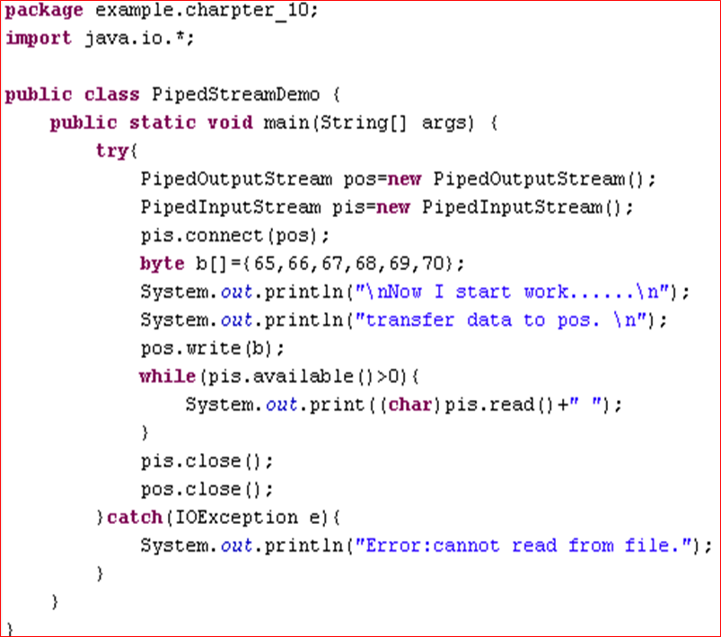

##### 8.2.5 对象流

- 能够输入输出对象的流称为对象流。
- 通过ObjectInputStream和两个类实现对象流。ObjectOutputStream

```java
//将一个Customer对象写入文件
Customer c=new Customer();
FileOutputStream f=new FileOutputStream(“D:/java/f.txt”);
ObjectOutputStream s=new ObjectOutputStream(f);
try{
     s.writeObject(c);
     s.close()
}catch(IOException e){
     e.printStackTrace();
}

//从文件中取出一个Customer对象实例
Customer c=null;
FileInputStream f=new FileInputStream(“D:/java/f.txt”);
ObjectInputStream s=new ObjectInputStream(f);
try{
     c=(Customer)s.readObject(c);
     c.close()
}catch(IOException e){
     e.printStackTrace();
}
```

##### 8.2.6 可持续性

- 持续性：记录自己的状态以便将来再生的能力，叫做对象持续性。
- 持续化：对象通过写出描述自己状态的数值来记录自己的过程叫做持续化(或串行化)。
- Serializable接口：当一个对象声明实现Serializable接口时，表明该类加入了对象串行化协议。
- 对象输出/输入流：要串行化一个对象，必须与特定的对象输出输入流联系起来，通过对象输出流将对象状态保存下来，之后再通过对象输入流将对象状态恢复，这一功能是通过ObjectOutputStream和ObjectInputStream两个类实现的。
- 串行化只能保存对象的**非静态成员变量**，而**不能保存任何成员方法和静态成员变量**，而且保存的只是变量的值，对于变量任何修饰都不能保存。
- 对于不可持续化的成员变量，用关键字**transient**标记。
- 当数据变量是一个对象时，该对象的数据成员也可以被持续化。对象的数据结构或结构树，包括其子树在内，构成了这个对象的结构表。
- 其他方法同8.2.5


#### 8.3 基本字符流

##### 8.3.1 Reader和Writer

- **区别在于之前的方法读入的是byte，现在改成char**

- 用于读取或者写入字符流的抽象类是Reader和Writer，它们支持的方法类似于字节流InputStream和OutputStream中的方法。
- InputStream中的方法read返回由某个int值的低8位构成的byte，而Reader中的方法read**返回由某个int值的低16位构成的char**。
- OutputStream具有可以写入byte数组的方法，Writer具有可以**写入char数组**的方法。

```java
package PPT10;
import java.io.*;
public class ReaderAndWriterDemo
{
    public static void main(String[] args) throws IOException
    {
        FileOutputStream fos = new FileOutputStream("my.txt");
        //创建Writer
        OutputStreamWriter osw = new OutputStreamWriter(fos, "utf-8");
        osw.write("哈尔滨工业大学");
        osw.close();
        //创建Reader
        FileInputStream fis = new FileInputStream("my.txt");
        InputStreamReader isr = new InputStreamReader(fis, "utf-8");
        int c = 0;
        while ((c = isr.read()) != -1)
        {
            System.out.print((char) c);
        }
        isr.close();
    }
}

```

##### 8.3.2 缓冲区读写

```java
整行处理方法：
public String readLine()
//BufferedReader的方法，从输入流中读取一行字符，行结束标志为‘\n’、‘\r’或两者一起。
public void newLine()
//BufferedWriter的方法，向输出流中写入一个行结束标志。
```


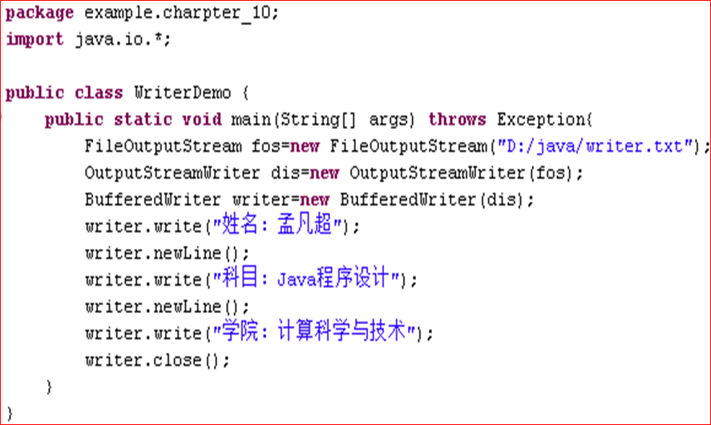

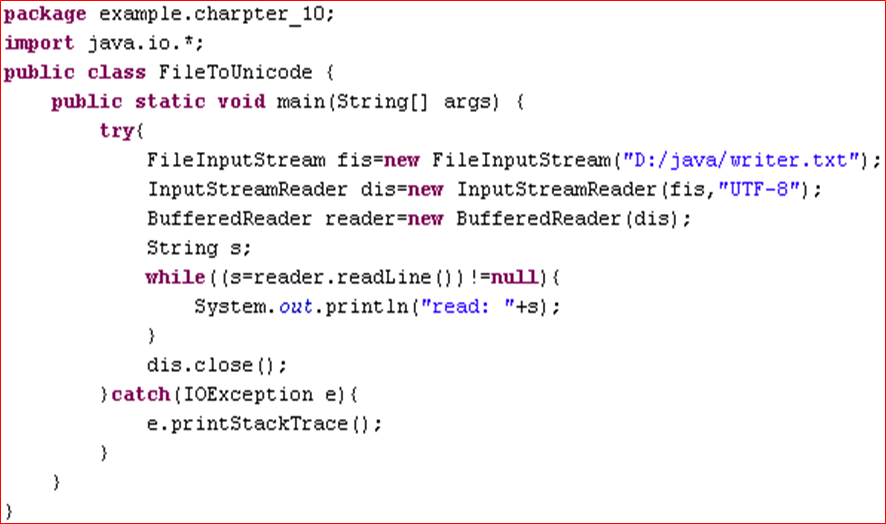

#### 8.4 文件处理

##### 8.4.1 文件类File

```java
File类构造方法：
public File(String 路径名)
public File(File parent, String child)
public File(String 文件路径, String 文件名)

```

##### 8.4.2 随机访问文件

- 在文件的任意位置读或写数据，可以同时进行读和写的操作。RandomAccessFile提供了对文件随机读写操作。

```java
RandomAccessFile  myRAFile;
myRAFile=new RandomAccessFile(“file1.txt”, “r”); 

File myFile= new File("mymotd");
RandomAccessFile  myRAFile;
myRAFile=new RandomAccessFile(myFile，” rw”); 

```

## 9.线程

### 9.1 进程与线程

- **进程一般是对操作系统而言的。即多个程序几乎在同一时间执行多个任务。**
- **线程一般是对某程序而言的。即每一程序同一时间内执行多个任务。**
- **从逻辑的观点来看，多线程意味着一个程序的多行语句同时执行**，但是多线程并不等于多次启动一个程序，操作系统也不会把每个线程当作独立的进程来对待。
- 两者的粒度不同，是两个不同层次上的概念。**进程是操作系统来管理的，而线程则是在一个程序(进程)内。**
- 不同进程的代码、内部数据和状态都是完全独立的，而一个程序内的多线程是共享同一块内存空间和同一组系统资源，又可能相互影响。
- 线程本身的数据通常只有寄存器数据，以及一个程序执行时使用的堆栈，所以线程的切换比进程切换的负担要小。
- 为了达到多线程的效果，Java语言把线程或执行环境当作一个封装对象，包含CPU及自己的程序代码和数据，由虚拟机提供控制。Java类库中的类java.lang.Thread允许创建这样的线程，并可控制所创建的线程。

### 9.2 并发与并行

- **并发是逻辑上的同时发生，并行是物理上的同时发生。**
- 并发(concurrency)是指在某一段时间内，从宏观上多个程序在同时运行，但在微观上多个程序之间是串行的。
- 并行(parallelism)指两个或两个以上的任务同时运行，无论从宏观上看，还是从微观上看，任务都是同时运行的。

### 9.3 Java线程的结构

- 虚拟CPU，封装在java.lang.Thread中，它控制着整个线程的运行。
- 执行的代码，传递给Thread类，由Thread类控制顺序执行。
- 处理的数据，传递给Thread类，是在代码执行过程中所要处理的数据。
- 线程分类：
  - 普通线程：在Java程序中，若还有非Demon线程，则整个程序不会结束
  - 守护线程：如果普通线程结束了，守护线程自动终止 setDaemon(true)

### 9.4 线程的状态

#### 9.4.1 Thread类

- Java的线程是通过类Thread来实现的，当生成一个Thread类的对象之后，就产生了一个线程。通过该对象实例，可以启动线程、终止线程，或者暂时挂起线程等。
- Thread类本身只是线程的虚拟CPU，线程所执行的代码是通过方法run()来完成的，方法run()称为线程体。实现线程体的特定对象是在初始化线程时传递给线程的。

#### 9.4.2 线程的状态

- 新建(new)
  当一个线程的实例被创建，即使用new关键字和Thread类或其子类创建一个线程对象后，此时该线程处于new状态。处于new状态的线程有自己的内存空间，但**该线程并没有运行，此时线程还不是活着的(not alive)**。
- 就绪状态(runnable) 
  **通过调用线程实例的start()方法来启动线程使线程进入就绪状态**处于就绪状态的线程已经具备了运行条件，但还没有被分配到CPU即不一定会被立即执行，此时处于线程就绪队列，等待系统为其分配CPU，等待状态并不是执行状态，此时线程是活着的(alive)。

- 运行状态(running)
  一旦获取CPU(被JVM选中)，线程就进入运行状态，线程的run()方法才开始被执行。在运行状态的线程执行自己的run()方法中的操作，直到调用其他的方法而终止、或者等待某种资源而阻塞、或者完成任务而死亡。如果在给定的时间片内没有执行结束，就会被系统给换下来回到线程的等待状态；此时线程是活着的(alive)。
- 阻塞状态(blocked)
  **通过调用join()、sleep()、wait()或者资源被暂用使线程处于阻塞状态**。处于阻塞状态的线程仍然是活着的(alive) 。
- 死亡状态(dead)
  **当一个线程的run()方法运行完毕或被中断或被异常退出**，该线程到达死亡(dead)状态。此时可能仍然存在一个该Thread的实例对象，当该Thread已经不可能在被作为一个可被独立执行的线程对待了。
  一旦某一线程进入dead状态，他就再也不能进入一个独立线程的生命周期了。对于一个处于Dead状态的线程调用start()方法，会出现一个运行期(runtime exception)的异常。处于dead状态的线程不是活着的(not alive)。


### 9.5 线程的创建

#### 9.5.1 继承Thread类

- 定义一个线程类，它**继承类Thread并重写其中的方法run()**，这时在初始化这个类的实例时，目标对象target可以为null，表示这个实例本身具有线程体。
- 由于Java只支持单继承，用这种方法定义的类不能再继承其他类。

#### 9.5.2 实现Runnable接口

- Runnable是Java中用以实现线程的接口，任何实现线程功能的类都必须实现该接口。前面所用到的Thread类就是因为实现了Runnable接口，所以它的子类才相应具有线程功能。
- Runnable接口中只定义了一个方法就是run()方法，也就是线程体。**用Runnable接口实现多线程时，也必须实现run()方法，常用Thread类的构造方法来创建线程对象。**

```java
public class CreateThread {

    public static void main(String[] args) {
        Thread1 thread1 = new Thread1();
        //声明一个Thread1对象，这个Thread1类继承自Thread类的

        Thread thread2 = new Thread(new Thread2());
        //传递一个匿名对象作为参数

        thread1.start();
        thread2.start();
        //启动线程
    }
}

class Thread1 extends Thread {
    @Override
    public void run() {
        //在run()方法中放入线程要完成的工作

        //这里我们把两个线程各自的工作设置为打印100次信息
        for (int i = 0; i < 100; ++i) {
            System.out.println("Hello! This is " + i);
        }

        //在这个循环结束后，线程便会自动结束
    }
}

class Thread2 implements Runnable {
    //与Thread1不同，如果当一个线程已经继承了另一个类时，就建议你通过实现Runnable接口来构造

    @Override
    public void run() {
        for (int i = 0; i < 100; ++i) {
            System.out.println("Thanks. There is " + i);
        }
    }
}
```

#### 9.5.3 Thread类的主要方法

- start();  //启动线程

- run(); //用来定义线程对象被调度之后执行的操作，用户必须重写run()方法

- yield(); //强制终止线程执行,给其他同等优先级一个运行的机会

- isAlive(); //测试当前线程是否在活动

- sleep(int millsecond); //使线程休眠一段时间，时间长短由参数所决定

- wait();使线程处于等待状态

  ```java
  try
  {
      Thread.sleep( int millsecond);
  }
  catch(InterruptedException e)
  {
     	e.printStackTrace();
  }
  ```

  

#### 9.5.4 线程的调度

- 时间片轮转调度策略
- 抢占式调度策略（java采用）

##### 9.5.4.1 Java线程的优先级策略

- 优先级高的先执行，优先级低的后执行。

- 多线程系统会自动为每个线程分配一个优先级，缺省时，继承其父类的优先级。

- 任务紧急的线程，其优先级较高。

- 同优先级的线程按“先进先出”的原则。

- 最大优先级值为10，最小优先级值为1，默认优先级值为5

- 与优先级有关的方法

  ```java
  Thread类中与优先级有关的方法
  void setPriority(int newPriority)：重置线程优先级。
  int : getPriority()：获得当前线程的优先级。
  static void yield()：使当前线程放弃执行权。
  ```

##### 9.5.4.2 join方法

- 在某些情况下，需要让某一个线程等待另一个线程执行结束后再开始执行该线程，可以使用线程类的join()方法来实现上述功能。

  ```java
  package ppt11;
  
  import edu.princeton.cs.algs4.StdOut;
  
  public class Join
  {
      public static void main(String[] args)
      {
          Thread c = new Thread(() -> StdOut.println("this is c"));
          var a = new Thread(new A(c));
          var b = new Thread(new B(a));
          a.start();
          b.start();
          c.start();
  
      }
  
  }
  
  class A implements Runnable
  {
      Thread thread;
  
      public A(Thread thread)
  
      {
          this.thread = thread;
      }
  
      @Override
      public void run()
      {
          StdOut.println("A.start");
          //插入c
          try
          {
              thread.join();
          } catch (InterruptedException e)
          {
              e.printStackTrace();
          }
  
          StdOut.println("A.end");
  
      }
  
  }
  
  class B implements Runnable
  {
      Thread thread;
  
      public B(Thread thread)
      {
          this.thread = thread;
      }
  
      @Override
      public void run()
      {
          StdOut.println("B.start");
          try
          {
              //插入A
              thread.join();
          } catch (InterruptedException e)
          {
              e.printStackTrace();
          }
  
          StdOut.println("B.end");
      }
  }
  
  /*
  结果
  B.start
  A.start
  this is c
  A.end
  B.end
  */
  ```

  

##### 9.5.3.2 线程的其他控制

- 结束线程：当一个线程从run()方法的结尾处返回时，它自动消亡并不能再被运行，可以将其理解为自然死亡。
- 中断线程：利用**interrupt()**方法可以使线程中断执行。在程序中调用了线程的interrupt()方法后，通常需要在线程的run()方法中使用**isInterrupt()**进行判断，并根据判断的结果执行相应的操作。

### 9.6线程的同步

- 当一个线程访问共享资源时，就会被共享的资源加锁，其它线程就不能访问被加了锁的资源，直到共享资源的锁被释放为止。这种**确保在同一时刻只允许一个线程访问共享资源的机制，称为线程同步**。
- **synchronized**来保证线程同步。 synchronized可用于方法和语句块，分别称为方法同步和语句块同步。

- 实例方法同步：对于实例方法， synchronized关键字指定的同步内容是该方法中的所有语句，指定的锁是该方法所在的对象。 

- 静态方法同步：对于类方法， synchronized关键字指定的锁是整个类，指定的同步内容是方法中的所有语句。**只要有一个实例的线程调用了被同步的方法，整个类就被指定所锁**，其它实例的线程在没有获得这个锁之前是无法调用这个类中被同步的方法。

- 语句块同步：以便缩小同步的范围，提高运行效率。

  ```java
  public synchronized void add() throws InterruptedException{};
  public static synchronized void add() throws InterruptedException{};
  public void add() throws InterruptedException{
      synchronized(lock)
      {
          //lock 可以为this(锁当前对象）,或者类名.class（锁整个类）
      }
  };
  
  ```

  

### 9.7 线程交互

- 解决共享对象的问题

- 等待集合：**每一个类的对象实例都有一个等待集合**，当在该实例上调用方法wait后，线程都会进入到该实例的等待集合中，除非发生下列情况，否则会一直等待在该等待集合中。

  - 其他线程调用了方法notify或notifyAll。
  - 其他线程调用了方法interrupt中断该线程。
  - 方法wait的等待时间结束。

- ```java
  try{
      wait();
  }catch(InterruptedException e){
      e.printStackTrace();
  }
  
  ```

- 方法wait()需要放入方法synchronized修饰的语句或方法中

- 当线程调用方法wait后，**Java虚拟机会让当前线程进入休眠状态，并释放对象同步锁的控制权**，允许其他线程执行同步代码块，要唤醒该线程，**需要在同一个对象上调用notify()或notifyAll()方法。**

- 方法notify和notifyAll不需要放入try{}catch{}语句中、notify和notifyAll的差别在于notify只唤醒一个线程， notifyAll可以唤醒所有线程。


### 9.8 线程池（略）


## 10.网络编程

### 10.1 概述

#### 10.1.1计算机网络体系结构

- 计算机网络体系结构：网络层次结构模型与各层协议的集合定义为计算机网络体系结构。
- 网络协议：是计算机彼此交流的一种“语言”，是网络通信的基础。任何一种通信协议都包含三个组成部分：语法、语义、时序。
  - 语法：规定了双方“如何讲”，即确定用户数据与控制信息的结构与形式。
  - 语义：规定了双方准备“讲什么”，即需要发出何种控制信息，以及完成的动作与做出的响应。
  - 时序：规定双方“何时进行通信”，即对事件实现顺序的详细说明。

#### 10.1.2 TCP/IP网络参考模型

- TCP/IP是一组用于实现网络互连的通信协议。
- Internet网络体系结构以TCP/IP为核心。
- 基于TCP/IP的参考模型将协议分成五个层次，它们分别是：**应用层、传输层、网络层、数据链路层、物理层。**
  - 应用层：**应用层是网络应用程序及其应用层协议存留的地方**。应用层包括许多协议，如HTTP协议(它为Web文档提供了请求和转发)、简单电子邮件传输（SMTP）、文件传输协议（FTP）、网络远程访问协议（Telnet）等。
  - 传输层：传输层提供了一个在应用程序的客户机和服务器之间传输应用层报文的服务。在因特网中，有两种传输层协议，**即TCP和UDP**。
    - TCP向它的应用程序提供了面向连接的服务，这种服务包括了应用层报文向目的地的确保传递和流量控制。
    - UDP向它的应用程序提供无连接服务，它是一种最基本的服务。
  - 网络层：网络层负责将称为数据报的网络层分组从一台主机移到另一台主机。在源主机中的运输层协议(TCP/ UDP)向网络层递交运输层报文段和目的地址，就像你向邮政信件提供目的地址一样。
  - 数据链路层：为了将分组从一个节点(主机或分组交换机)移动到路由器上的下一个节点，网络层必须依靠链路层的服务。在每个节点，网络层将数据报下传给链路层，链路层沿着路由将数据报传递给下一个节点，在该下一个节点，链路层将数据报上传给网络层。
  - 物理层：链路层的任务是从一个网络单元向邻近的网络单元移动整个帧，而物理层的任务是将该帧的一个一个比特从一个节点移动到下一个节点。

#### 10.1.3 基本概念

- IP地址：连接到TCP/IP网络中的每台计算机(或其他设备)都有唯一的地址，这就是IP地址。
- 端口号(Port)：一台机器只能通过一条链路连接到网络，但一台机器中往往有很多程序需要进行网络通信，仅靠IP地址区分不了各应用程序，这就需要端口号。**端口号是一个标记机器的逻辑通信信道的整整数。端口号取值范围0-65535，其中0-1023为系统所保留。**
- 套接字(Socket)：传输层是通常是以TCP和UDP协议来控制端点到端点的通信，用于通信的端点是由Socket来定义的，**Socket是由IP地址和端口号组成的。**
- 传输控制协议(TCP) 
  - TCP定义了网络上程序到程序的数据传输格式和规则，提供了IP数据包的传输确认、丢失数据包的重新请求、将收到的数据包按照它们的发送次序重新装配的机制，**是一种面向连接的保证可靠传输的协议。**
  - **发送方和接收方的成对的两个socket之间必须建立连接**，以便在TCP协议的基础上进行通信，当一个socket（通常都是server socket）等待建立连接时，另一个socket可以要求进行连接，一旦这两个socket连接起来，**它们就可以进行双向数据传输，双方都可以进行发送或接收操作。**  
- 用户数据报协议(UDP)
  - 与TCP协议不同， **UDP则是一种无连接的传输协议。**
  - 利用UDP进行数据传输时，首先需要将要传输的数据定义成数据报(Datagram)，在数据报中指明数据所要到达的端点(Socket)，然后再将数据报发送出去。
  - **UDP是无序的，不能确保绝对的安全可靠，但是它简单、效率高。**
- 域名：一个域名的目的是便于记忆和沟通的一组服务器的地址。
- 统一资源定位器(URL)：
  URL表示Internet上某一资源的地址。 Internet上资源包括HTML文件、图像文件、声音文件、动画文件以及其他任何内容。通过URL就可以访问Internet。浏览器或其他程序通过解析格给定的URL就可以在网络上查找相应的文件或其他资源。
  一个URL的语法格式如下：
    <protocol>://<hostname:port>/dir/filename

### 10.2 InetAddress

- 类InetAddress是Java的IP地址封装类

- InetAddress没有构造函数,不能通过new方法获得他的实例

  ```java
  package ppt12;
  
  import edu.princeton.cs.algs4.StdOut;
  
  import java.net.InetAddress;
  import java.net.UnknownHostException;
  
  public class Inet
  {
      public static void main(String[] args)
      {
          InetAddress ia1 = null;
          InetAddress ia2 = null;
          InetAddress ia3[] = null;
          try
          {
              ia1 = InetAddress.getByName("www.pornhub.com");//通过机器名、ip、DSN域名获取
              ia2 = InetAddress.getLocalHost();//得到本机
              ia3 = InetAddress.getAllByName("www.91porn.com");
          } catch (UnknownHostException e)
          {
              e.printStackTrace();
          }
  
          StdOut.println(ia1.toString());
          StdOut.println(ia1.getHostName()+ia1.getHostAddress());
          //上面两句等价
          StdOut.println(ia2.toString());
          for (var i : ia3)
          {
              StdOut.println(i.toString());
          }
      }
  
  }
  ```


### 10.3 统一资源定位器

#### 10.3.1 URL概念

```java
URL表示Internet上某种资源的地址。
一个URL的语法格式如下：
  <protocol>://<host:port>/filename/reference
protocol：用来表示所要获取资源的传输协议，如：http、ftp、file等。
host：用来指示资源所在的主机。
port：用来指示连接时所使用的通信端口号。
filename：用来指示该资源在主机的完整文件名。
reference：指示资源中的某个特定位置。
```

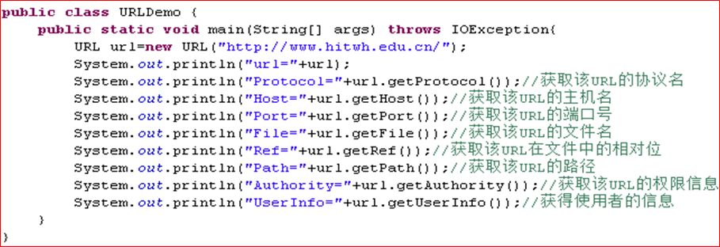

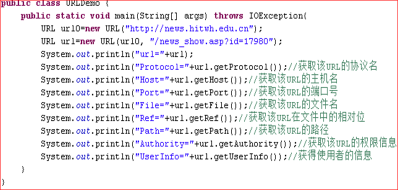

####  10.3.2 读入数据

```java
package ppt12;

import edu.princeton.cs.algs4.StdOut;

import java.io.BufferedReader;
import java.io.IOException;
import java.io.InputStreamReader;
import java.net.MalformedURLException;
import java.net.URL;
import java.net.UnknownHostException;

public class ReadURL
{
    //读入一个完整的网页
    public static void main(String[ ] args )
    {
        try
        {
            var url=new URL("http://172.26.50.21/login");//创建URL
            var isr= new InputStreamReader(url.openStream());//创建Reader
            var br=new BufferedReader(isr);//BufferedReader
            String readstring;
            while((readstring=br.readLine())!=null)
            {
                StdOut.println(readstring);
            }
            br.close();
            isr.close();
        }
        catch (MalformedURLException e)
        {
            e.printStackTrace();
        } catch (IOException e)
        {
            e.printStackTrace();
        }

    }
}

```

#### 10.3.3 双向通信

使用URLConnection类

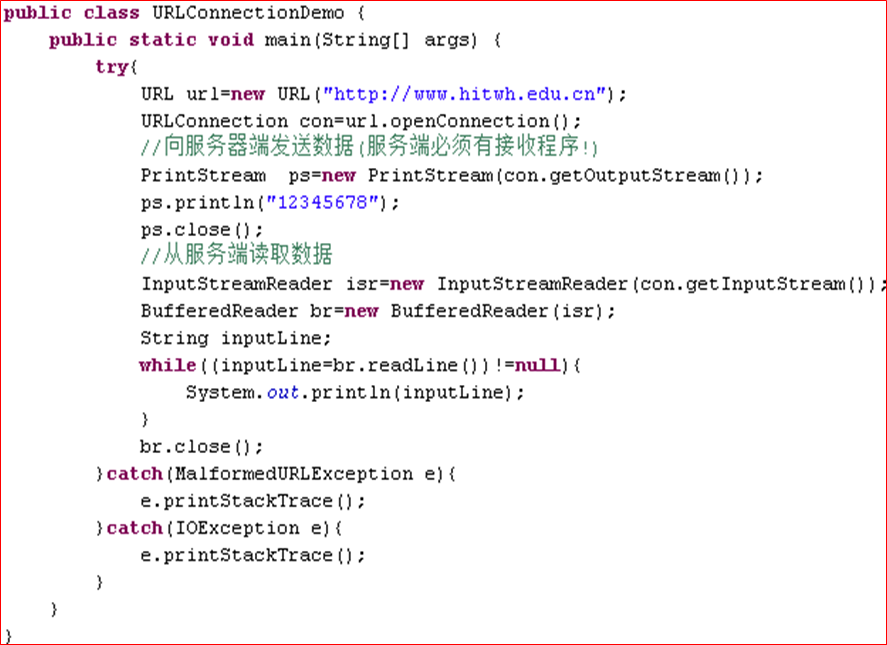

### 10.4 Socket

#### 10.4.1 通信的一般步骤-TCP协议

- 先在服务器端生成一个ServerSocket实例对象，并通过accept()方法随时监听客户端的连接请求。
- 当客户端需要连接时，相应地要生成一个Socket实例对象，并发出连接请求，其中host参数指明该主机名，port参数指明该主机端口号。
- 服务器端通过accept()方法接收到客户端的请求后，开辟一个接口与之进行连接，并生成所需的I/O数据流。
- 客户端和服务器端的通信都是通过一对InputStream和OutputStream进行的。通信结束后，两端分别关闭对象的Socket接口。

示例：多人聊天室

服务器端：

接收新创建的服务器：

```java
package ppt12.server;

import java.io.IOException;
import java.net.ServerSocket;
import java.net.Socket;
import java.util.Vector;

public class Server
{

    //存储多个服务器的地址
    private static Vector<Socket> socketlist = new Vector<Socket>();

    public static void main(String[] args) {
        try {

            ServerSocket ss = new ServerSocket(50000);//设置socket服务器端口
            while(true){
                Socket s = ss.accept();//接受连接并返回socket对象
                socketlist.add(s);
                //打印socketlist中全部的元素，并调用每个socketlist的toString方法
                System.out.println(socketlist);
                new Thread(new DispatcherMessage(s,socketlist)).start();
            }
        } catch (IOException e) {
            e.printStackTrace();
        }
    }
}
```

消息广播端：

```java
package ppt12.server;

import java.io.*;
import java.net.Socket;
import java.util.Vector;

public class DispatcherMessage implements Runnable
{
    //消息广播
    private Socket s = null;
    private BufferedReader br = null;
    private Vector<Socket> socketlist = null;

    public DispatcherMessage(Socket s, Vector<Socket> socketlist)
    {
        this.socketlist = socketlist;
        this.s = s;
        try
        {
            br = new BufferedReader(new InputStreamReader(s.getInputStream()));
        } catch (IOException e)
        {
            e.printStackTrace();
        }
    }

    public void DispathcherMessage()
    {

        String result = null;
        try
        {
            while ((result = br.readLine()) != null)
            {
                //对每个socket进行广播
                for (Socket allsocket : socketlist)
                {
                    //向除了s（发送端）之外的所有接收端发送消息
                    if (!s.equals(allsocket))
                    {
                        //服务器端的输出
                        System.out.println(allsocket.toString()+"收到了:"+result );

                        BufferedWriter bw = new BufferedWriter(new OutputStreamWriter(allsocket.getOutputStream()));
                        bw.write(result);
                        bw.newLine();//一定不能忘了！！！
                        bw.flush();
                    }
                }
            }
        } catch (IOException e)
        {
            e.printStackTrace();
        }
    }

    public void run()
    {
        while (true)
        {
            DispathcherMessage();
        }
    }
}

```

客户端

客户服务器创建：

```java
package ppt12.cilent;

import java.net.InetAddress;
import java.net.Socket;

public class Cilent
{
    /*
     * 任务：
     * 1.为每一个Client用户创建一个Socket
     * 2.开启发送线程
     * 3.开启接受线程
     */
    public static void main(String[] args) throws Exception
    {
        //创建Socket
        Socket ss = new Socket(InetAddress.getLocalHost(), 50000)//主机地址，主机端口号;
        //接收消息线程
        new Thread(new ReceiceMessage(ss)).start();
        //发送消息线程
        new Thread(new SendMessage(ss)).start();
    }
}
```

客户信息发送

```java
package ppt12.cilent;

import java.io.*;
import java.net.Socket;

public class SendMessage implements Runnable
{

    private BufferedWriter bw = null;
    private Socket s;

    public SendMessage(Socket s)
    {
        try
        {
            this.s=s;
            //消息发送流
            bw = new BufferedWriter(new OutputStreamWriter(s.getOutputStream()));
        } catch (IOException e)
        {
            e.printStackTrace();
        }

    }

    public void Writer()
    {
        //从控制台读取信息
        BufferedReader br = new BufferedReader(new InputStreamReader(System.in));

        String result = null;
        try
        {
            while ((result = br.readLine()) != null)
            {
                //标明发送方
                result=s.toString()+"说"+result;
                bw.write(result);
                bw.newLine();
                bw.flush();
            }
        } catch (IOException e)
        {
            e.printStackTrace();
        }
    }

    public void run()
    {
        while (true)
        {
            Writer();
        }
    }
}

```

客户信息接受

```java
package ppt12.cilent;

import java.io.BufferedReader;
import java.io.IOException;
import java.io.InputStreamReader;
import java.net.Socket;

public class ReceiceMessage implements Runnable
{
    //author pzh hueedu
    /*
     * 拿到Socket的对应的接受流 死循环接受数据并打印在控制台上
     */
    private Socket s;
    private BufferedReader br = null;

    public ReceiceMessage(Socket s)
    {
        try
        {
            this.s = s;
            //信息读取流
            this.br = new BufferedReader(new InputStreamReader(s.getInputStream()));
        } catch (IOException e)
        {
            e.printStackTrace();
        }
    }

    public String recive()
    {//函数目的 把收到一行数据返回


        String result = null;
        try
        {
            while ((result = br.readLine()) != null)
            {
                System.out.println(s.toString() + "接受到了服务器端数据:" + result);
            }

        } catch (IOException e)
        {
            e.printStackTrace();
        }
        return result;
    }

    public void run()
    {//死循环 用于输出接受到的数据
        while (true)
        {
            recive();
        }
    }
}
```

#### 10.4.2ServerSocket主要方法

| **方法名**                      | **功能说明**                                                 |
| ------------------------------- | ------------------------------------------------------------ |
| Socket accept()                 | 接收该连接并返回该连接的Socket对象                           |
| void close()                    | 关闭此服务器的Socket                                         |
| InetAddress getInetAddress()    | 获取该服务器Socket所绑定的地址                               |
| int getLocalPort()              | 获取该服务器Socket所侦听的端口号                             |
| int getSoTimeout()              | 获取连接的超时数                                             |
| void setSoTimeout(int  timeout) | 设置连接的超时数，参数表示 ServerSocket  的 accept()  方法等待客户连接的超时时间。如果参数值为  0 ,  表示永远不会超时，进入阻塞状态  这也是它的默认值 |

#### 10.4.3 Socket主要方法

| 方法名                          | 功能说明                             |
| ------------------------------- | ------------------------------------ |
| void  close()                   | 关闭Socket连接                       |
| InetAddress getInetAddress()    | 获取当前连接的远程主机的Internet地址 |
| InputStream  getInputStream()   | 获取Socket对应的输入流               |
| InetAddress  getLocalAddress()  | 获取本地主机的Internet地址           |
| int  getLocalPort()             | 获取本地连接的端口号                 |
| OutputStream  getOutputStream() | 获取该Socket的输出流                 |
| int  getPort()                  | 获取远程主机端口号                   |
| void  shutdownInput()           | 关闭输入流                           |
| void  shutdownOutput()          | 关闭输出流                           |